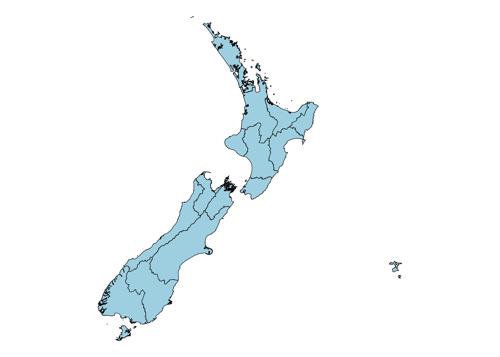
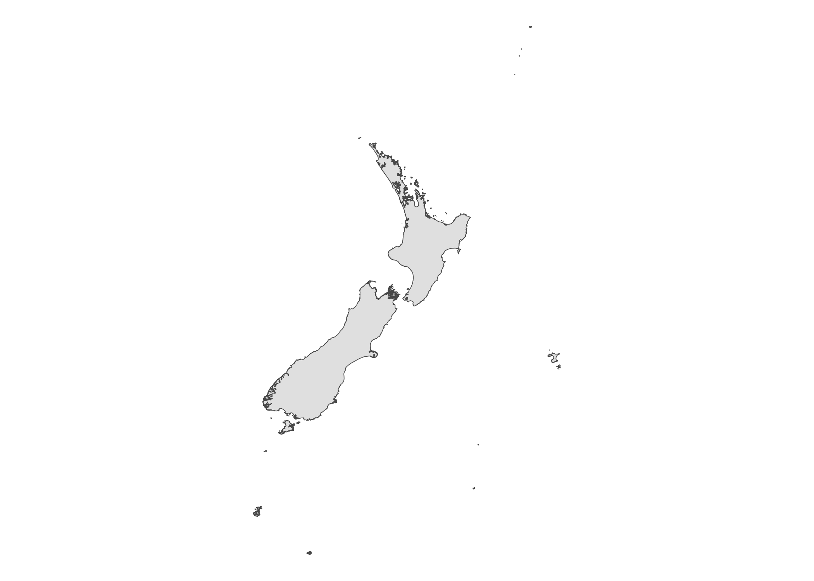

# koordinatr

<!-- badges: start -->

[](https://lifecycle.r-lib.org/articles/stages.html#experimental)
[](https://CRAN.R-project.org/package=koordinatr)
<!-- badges: end -->

The goal of koordinatr is to provide API access to spatial and tabular
data from various New Zealand government agencies which use a
Koordinates data service.

## Installation

You can install the development version of koordinatr like so:

``` r
# install.packages("devtools")
devtools::install_github("isaacbain/koordinatr")
```

## Usage

### Authenticate

To use the package, you will need to authenticate with an API key. These
can be obtained from the respective agencies’ websites.

``` r
library(koordinatr)

api_key <- "your_api_key"
```

Alternatively, you can also store your API key in your .Renviron file,
so you don’t have to go looking for it each time. First edit your
.Renviron file with the following command:

``` r
usethis::edit_r_environ()
```

Add a line similar to this with your API key to the .Renviron file, save
the .Renviron file and restart your R session:

``` r
koordinates_api_key="paste_your_api_key_here"
```

Then you can use your API key like so (referring to it as whatever you
called it in the step above):

``` r
get_layer_as_sf(api_key = Sys.getenv("koordinates_api_key") # or whatever you called it
```

### Fetch a spatial layer

This is a basic example which uses the `get_layer_as_sf` function to
fetch a spatial layer from LINZ and return it as an `sf` object.

- `agency` should be one of “linz”, “statsnz”, “mfe”. Or “custom” if you
  want to manually specify the URL for the service.

- `id` should be the ID of the layer you want to fetch.

``` r
# libraries
library(ggplot2)

# get spatial layer from MfE
result_sf <- get_layer_as_sf(Sys.getenv("mfe_api_key"),
                             agency = "mfe",
                             id = "118263")

# map
ggplot() +
  geom_sf(data = result_sf, aes(fill = LUCID_2020), colour = NA) +
  scale_fill_viridis_d() +
  theme_bw() +
  labs(title = "LUCAS Chatham Islands \nLand Use Map 2020") +
  theme(legend.position = "none") +
  theme(axis.text.x = element_text(angle = 90, vjust = 0.5, hjust = 1))
```


``` r


# get spatial layer from custom url

result_sf2 <- get_layer_as_sf(Sys.getenv("lris_api_key"),
                              agency = "custom",
                              id = "48157",
                              custom_url = "https://lris.scinfo.org.nz/services;key=")

ggplot() +
  geom_sf(data = result_sf2, aes(fill = Series_1), colour = NA) +
  scale_fill_viridis_d() +
  theme_bw() +
  labs(title = "Soil map for the Upper Plains and Downs of Canterbury") +
  theme(legend.position = "none")
```


### Fetch a table

This is a basic example which uses the `get_table_as_tibble` function to
fetch a table from MfE and return it as a `tibble`.

``` r
# get tables
result_tibble <- get_table_as_tibble(Sys.getenv("mfe_api_key"),
                                     agency = "mfe",
                                     id = "53606")

knitr::kable(result_tibble[1:10, 1:5])
```

| gml_id         | Lake        | Status        | Date       | LakeSPI_percent |
|:---------------|:------------|:--------------|:-----------|:----------------|
| table-53606.1  | Alexandrina | High          | 7/04/2015  | 54.00%          |
| table-53606.2  | Alice       | Moderate      | 11/11/2015 | 28.00%          |
| table-53606.3  | Aniwhenua   | Poor          | 6/03/2014  | 12.00%          |
| table-53606.4  | Arapuni     | Poor          | 4/03/2009  | 12.00%          |
| table-53606.5  | Aratiatia   | Moderate      | 2/03/2009  | 27.00%          |
| table-53606.6  | Areare      | Non-vegetated | 18/05/2015 | 0.00%           |
| table-53606.7  | Atiamuri    | Poor          | 3/03/2009  | 11.00%          |
| table-53606.8  | Austria     | Moderate      | 3/11/2005  | 46.00%          |
| table-53606.9  | Aviemore    | High          | 8/04/2015  | 62.00%          |
| table-53606.10 | B           | Non-vegetated | 1/02/2007  | 0.00%           |

## Wrapper functions

The package also includes some wrapper functions which make it easier to
fetch *some* commonly used layers.

### Regions

`get_regions_layer()` fetches the 2023 generalised clipped regional
council boundaries layer from Stats NZ.

``` r
regions <- get_regions_layer(api_key = Sys.getenv("koordinates_api_key"))
#> Reading layer `datafinder.stats.govt.nz:layer-111181' from data source 
#>   `https://datafinder.stats.govt.nz/services;key=dd78f0283b414914ab22d13f2770fbe0/wfs/layer-111181/?service=WFS&request=GetCapabilities' 
#>   using driver `WFS'
#> Simple feature collection with 17 features and 8 fields
#> Geometry type: MULTISURFACE
#> Dimension:     XY
#> Bounding box:  xmin: 1089970 ymin: 4747987 xmax: 2470102 ymax: 6223156
#> Projected CRS: NZGD2000 / New Zealand Transverse Mercator 2000
```

``` r

ggplot() +
  geom_sf(data = regions, fill = "lightblue", colour = "black") +
  theme_void()
```



### Coastline

`get_coastline_layer()` fetches either the 1:50k topo polyline or
polygon from LINZ. You can set `layer_type` to either “line” or
“polygon”.

``` r
coastline <- get_coastline_layer(api_key = Sys.getenv("linz_api_key"),
                                 layer_type = "polygon")
#> Reading layer `data.linz.govt.nz:layer-51153' from data source 
#>   `https://data.linz.govt.nz/services;key=d0a74083759843229e65947888902509/wfs/layer-51153/?service=WFS&request=GetCapabilities' 
#>   using driver `WFS'
#> Simple feature collection with 9121 features and 8 fields
#> Geometry type: CURVEPOLYGON
#> Dimension:     XY
#> Bounding box:  xmin: 165.869 ymin: -52.62088 xmax: 183.8457 ymax: -29.23134
#> Geodetic CRS:  NZGD2000
```

``` r

ggplot() +
  geom_sf(data = coastline) +
  theme_void()
```



### Catchments

`get_catchments_layer()` fetches the sea-draining catchments layer from
MfE.

``` r
catchments <- get_catchments_layer(api_key = Sys.getenv("mfe_api_key"))
#> Reading layer `data.mfe.govt.nz:layer-99776' from data source 
#>   `https://data.mfe.govt.nz/services;key=86387251050a4f149ef69abecd04d308/wfs/layer-99776/?service=WFS&request=GetCapabilities' 
#>   using driver `WFS'
#> Simple feature collection with 10131 features and 4 fields
#> Geometry type: MULTISURFACE
#> Dimension:     XY
#> Bounding box:  xmin: 1090080 ymin: 4748607 xmax: 2089398 ymax: 6193865
#> Projected CRS: NZGD2000 / New Zealand Transverse Mercator 2000
```

``` r

ggplot() +
  geom_sf(data = catchments, colour = "black", linewidth = 0.1) +
  theme(legend.position = "none") +
  theme_void()
```


